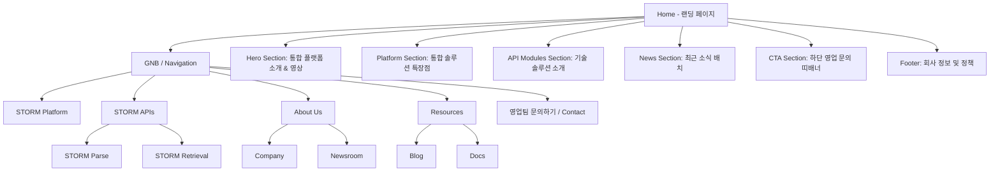
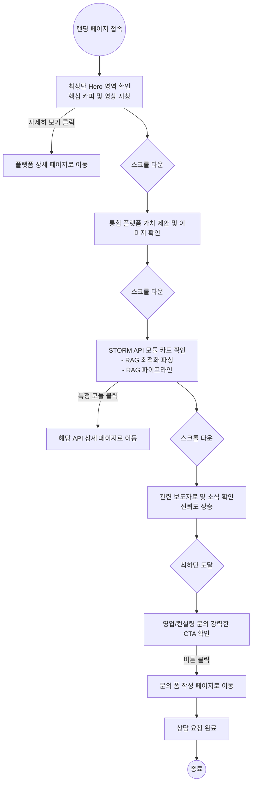

# Sionic AI 스타일 랜딩 페이지 구축 계획서 (Benchmarking Plan)

본 문서는 `https://www.sionic.ai/ko` 웹사이트를 분석하여 도출한 정보 구조(IA), 사용자 플로우차트, 그리고 섹션별 와이어프레임 구조를 담은 기획 문서입니다. 

---

## 1. 레퍼런스 웹사이트 분석 (Sionic.ai/ko)
Sionic AI의 랜딩 페이지는 **B2B(기업용) AI-Native 솔루션**을 강조하는 프로페셔널하고 신뢰감을 주는 구조로 되어 있습니다. 
주요 특징은 다음과 같습니다:
- **직관적인 메시지 전달**: 명확한 타이포그래피와 핵심 카피라이팅을 통해 서비스(STORM)의 가치를 최상단에서 바로 전달.
- **풍부한 미디어 활용**: 백그라운드 비디오 및 고품질 이미지를 사용하여 정적인 단순 텍스트보다 훨씬 동적이고 세련된 인상 제공.
- **모듈화된 솔루션 소개**: 플랫폼 전체 소개와 개별 API (Parse, Retrieval)를 세분화하여 시각적인 카드 형태로 제시.
- **강력한 CTA(Call To Action)**: 페이지 곳곳과 최하단에 상담/문의(영업팀 문의하기) 유도를 뚜렷하게 배치하여 비즈니스 전환을 이끌어냄.

---

## 2. 정보 구조도 (IA - Information Architecture)

---

## 3. 사용자 플로우 차트 (User Flow Chart)

사용자가 랜딩 페이지에 접속하여 기술 스택을 둘러보고 결국 도입 문의를 남기게 되는 흐름입니다.

---

## 4. 와이어프레임 구조 (Wireframe Breakdown)

새롭게 제작할 RAG 솔루션 랜딩 페이지의 와이어프레임을 Sionic AI 스타일 기반으로 섹션별로 구성한 형태입니다.

### [Header / GNB 영역]
- **Left**: 로고 (클릭 시 메인으로)
- **Center**: 링크 메뉴 (Platform, APIs, Company, Blog 등)
- **Right**: Language Selector(KR/EN), 문의하기(Contact) 버튼

---

### [Section 1 : Hero 인트로]
- **Background**: 강렬한 서비스 소개형 백그라운드 자동재생 비디오
- **Content**: 
  - (Top Tag) `STORM PLATFORM`
  - (Main Title) "기업에 최적화된 생성형 AI로 비즈니스 생산성을 높여보세요"
  - (Button) [ 자세히 보기 + 화살표 아이콘 ] (호버 시 색상/화살표 애니메이션)

---

### [Section 2 : 플랫폼 통합 솔루션]
- **Content**:
  - (Top Tag) `STORM PLATFORM`
  - (Main Title) "Sionic AI는 기업 내 생성형 AI 도입 시 발생하는 다양한 문제들을 단 하나의 통합 플랫폼으로 해결합니다"
- **Visual Element**: 플랫폼의 전체적인 구조를 보여주는 대형 인포그래픽/다이어그램 이미지 (카드 형태 둥근 모서리)

---

### [Section 3 : 개별 API 기능 (STORM APIs)]
- **Background**: 옅은 파스텔 톤 (ex. #F5FAFF) 구분을 통한 위젯 강조
- **Headings**:
  - (Top Tag) `STORM APIs`
  - (Main Title) "비즈니스 혁신을 위한 Sionic AI만이 가진 기술 솔루션을 소개합니다"
- **Cards Layout (Grid 형태)**:
  - **Card 1**: 관련 썸네일 + [RAG 최적화 데이터 파싱 엔진] 설명 + [자세히 보기]
  - **Card 2**: 관련 썸네일 + [비전문가도 지속 개선 가능한 RAG 파이프라인] 설명 + [자세히 보기]
*(카드에 마우스를 올릴 때 테두리 색상 변화 등 마이크로 인터랙션 적용)*

---

### [Section 4 : 미디어 / 뉴스룸]
- **Headings**:
  - (Top Tag) `NEWS`
  - (Main Title) "새로운 소식을 빠르게 만나보세요"
- **News Grid (3 Columns)**:
  - 기사 대표 이미지 + 메인 헤드라인 + 작성/보도 일자 
- **Button**: [뉴스 전체 보기] 아웃라인 버튼 배치 (중앙 정렬)

---

### [Section 5 : 하단 강력한 CTA (Contact)]
- **Background**: 다크톤 배경 및 세련된 패턴 배경 이미지 (`contact-bg.png` 같은 리소스 사용)
- **Content**:
  - (Main Title) "엔터프라이즈 AI 도입 경험이 풍부한 AI 전문가와 지금 상담해 보세요" (가운데 정렬)
  - (Button) [営業팀 문의하기] (검은색 배경 반전 호버 효과 + 그라데이션 텍스트 적용 된 흰색 버튼)

---

### [Footer 영역]
- **Top Elements**: 사이트 맵 형태로 Nav 링크 전체 리스팅 (Platform, APIs(Parse, Retrieval), About Us, Resources)
- **Bottom Content**: 
  - 회사 기본 정보(주소, 이메일)
  - 글로벌 주소 안내 (KR, JP)
  - 사이오닉에이아이 주식회사 | 대표자명 | 사업자번호
  - 이용약관 | 개인정보처리방침
  - Copyright Text
