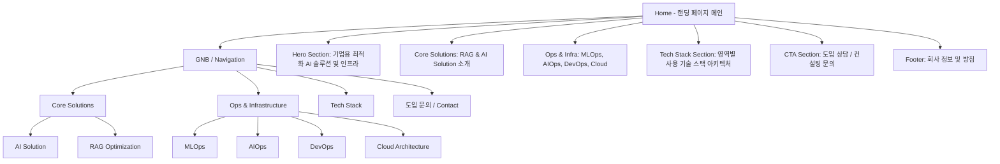
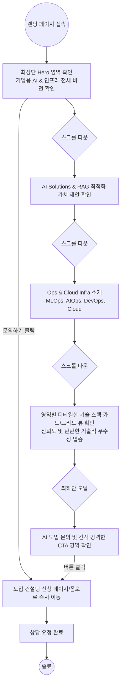

# Sionic AI 스타일 랜딩 페이지 구축 계획서 (Benchmarking Plan)

본 문서는 `https://www.sionic.ai/ko` 웹사이트의 프로페셔널한 구조를 벤치마킹하여, **RAG, AIOps, Cloud, MLOps, DevOps, AI Solution** 사업 영역을 강조하기 위한 랜딩 페이지의 정보 구조(IA), 사용자 플로우차트, 섹션별 와이어프레임을 담은 기획 문서입니다.

---

## 1. 랜딩 페이지 핵심 전략 및 방향성
- **프로페셔널 & 엔터프라이즈 타겟**: 기업용 AI 도입 및 IT 인프라 혁신을 이끄는 전문성을 강조.
- **6대 핵심 가치 모듈화**: RAG, AIOps, Cloud, MLOps, DevOps, AI Solution 6가지 핵심 영역과 각각을 뒷받침하는 기술 스택을 명확한 카드/그리드 UI로 시각화.
- **직관적인 동선과 동적 요소**: 스크롤에 따라 나타나는 애니메이션(Fade-in, Hover 효과)을 적절히 활용하여 신뢰감을 주고 하단의 도입 안내/상담 문의(CTA)로 자연스럽게 유도.

---

## 2. 정보 구조도 (IA - Information Architecture)

---

## 3. 사용자 플로우 차트 (User Flow Chart)

최상단 영상/비주얼에서 시작해 각 솔루션 영역과 기술 스택의 강점을 이해한 뒤 문의를 남기는 흐름입니다.

---

## 4. 와이어프레임 구조 (Wireframe Breakdown)

새롭게 제작할 랜딩 페이지의 와이어프레임을 서비스 도메인(RAG, AIOps 등)과 기술 스택 중심으로 재구성했습니다.

### [Header / GNB 영역]
- **Left**: 브랜드 로고 (클릭 시 탑으로 스크롤 이동)
- **Center**: 링크 메뉴 라벨 (Solutions, Ops & Infra, Tech Stack, About Us)
- **Right**: 다크/라이트 모드 토글, 강렬한 색상의 `[문의하기 (Contact)]` 강조 버튼 배치

---

### [Section 1 : Hero 인트로 (비전 및 종합 안내)]
- **Background**: 강렬하고 추상적인 3D 애니메이션 (예: 서버 데이터/연결망 노드가 결합하는 동적 비주얼 아트워크 영상)
- **Content**: 
  - (Top Tag) `ENTERPRISE DATA & AI INFRASTRUCTURE`
  - (Main Title) "비즈니스 혁신의 시작, 완벽한 통합 AI 비전 플랫폼"
  - (Sub Title) "기업용 RAG 솔루션부터 클라우드 인프라, 최적화된 AIOps까지. 모든 인프라를 통제하여 데이터의 잠재력을 무한하게 극대화합니다."
  - (Button) `[ 주요 솔루션 살펴보기 ↓ ]` (부드러운 스크롤 점프 액션 버튼)

---

### [Section 2 : Core Solutions (AI Solution & RAG)]
- **Headings**:
  - (Top Tag) `CORE SOLUTIONS`
  - (Main Title) "생성형 AI의 완벽하고 안전한 실무 도입"
- **Grid View (2 Columns Layout)**:
  - **① AI Solution**: 프롬프트 엔지니어링 및 통합 매니지먼트, LLM 에이전트 구축 등 전사적 AI 애플리케이션 플랫폼 도입.
  - **② RAG Optimization**: 복잡한 정형/비정형 데이터의 구조화, 고성능 파이프라인과 벡터 임베딩 최적화를 통한 할루시네이션 방지 검색 증강 생성(RAG) 기술의 진수.
- **Visuals**: 데이터가 정제되고 LLM과 응답을 주고받고 생성되는 사이클을 나타내는 인포그래픽 배치 (모던한 라인 드로잉 느낌).

---

### [Section 3 : Ops & Infrastructure (클라우드 및 운영 효율화)]
- **Headings**:
  - (Top Tag) `OPS & CLOUD INFRASTRUCTURE`
  - (Main Title) "안정적이고 한계 없이 확장 가능한 AI 시스템의 라이프사이클 운영"
- **Cards Layout (4 Grid Cards)**: (각 카드에 마우스 호버 시 글래스모피즘 라이팅/플로팅 애니메이션 효과 적용)
  - **MLOps**: 모델 학습, 테스트, 배포, 지속적인 모니터링을 관장하는 머신러닝 파이프라인의 완전 자동화 체계.
  - **AIOps**: AI 기술을 활용한 지능형 IT 운영. 모니터링, 이상 징후 선제적 자동 탐지 및 핵심 자원 최적화 할당.
  - **DevOps**: 애자일 기반의 지속적 통합(CI) 및 지속적 배포(CD) 파이프라인. 마이크로서비스 확립으로 신속하고 안전한 서비스 배포 주기 확립.
  - **Cloud Architecture**: AWS, GCP, Azure 등 하이브리드 멀티 클라우드 환경 설계와 고가용성 네트워크 및 스토리지 솔루션 구축.

---

### [Section 4 : Technology Stack (기술 스택 매트릭스)]
*(서비스의 전문성과 신뢰도를 시각화하는 기술 뱃지와 스택 아키텍처 그리드 영역)*
- **Background**: 사이트의 전체 배경 톤과 대비되는 은은한 그레이톤 또는 그라데이션 박스로 시선 집중 구조 팩킹.
- **Headings**: 
  - (Main Title) "최상의 성과를 제공하는 검증된 기술 스택 파트너십"
- **Stack Categories Layout (개별 탭 분리 UI 또는 인피니트 롤링 배너 캐러셀 형태)**:
  - **GenAI / RAG 핵심 스택**: `LangChain`, `LlamaIndex`, `Pinecone`, `Milvus`, `OpenAI`, `Anthropic`, `Hugging Face`
  - **AI / MLOps 인프라**: `MLflow`, `Kubeflow`, `Ray`, `Triton Inference Server`
  - **DevOps 엔지니어링**: `GitHub Actions`, `Jenkins`, `Docker`, `Kubernetes(K8s)`, `Terraform`, `ArgoCD`
  - **Data 인프라 / AIOps**: `Datadog`, `Prometheus`, `Grafana`, `ELK (Elasticsearch)`, `Apache Kafka`
  - **Cloud Computing**: `AWS`, `Google Cloud`, `Microsoft Azure`, `Linux`
- **Component UI 디자인 가이드**: 각 카테고리의 칩(Chip)이나 로고를 마우스 호버 시 본래의 컬러 로고 톤으로 변경(필터 트랜지션 효과 적용) 시켜 인터랙티브하고 트렌디하게 연출.

---

### [Section 5 : 하단 강력한 CTA (Contact)]
- **Background**: 브랜드 아이덴티티를 살리는 세련된 다크 블루 바탕 혹은 블랙 글래스모피즘 패턴 (#071121 계열 등)
- **Content**:
  - (Main Title) "기업에 가장 최적화된 아키텍처를 원하십니까? 최고의 IT 인프라 엔지니어 전문 그룹과 지금 비즈니스를 개척하세요."
  - (Button) `[ 도입 컨설팅 및 기술 의뢰 문의하기 ]` (마우스 호버 시 우측 화살표 `→` 이동 모션 애니메이션과 텍스트 브라이트닝 효과 적용된 둥근 모서리 버튼)

---

### [Footer 영역]
- **Top Elements**: 심플 사이트맵 구조로 내비게이션 요소 재정렬.
  - Solutions (RAG, AI Solution)
  - Infrastructure (MLOps, AIOps, DevOps, Cloud)
  - Tech Stack Overview
- **Bottom Content**: 
  - (회사 명칭) 코퍼레이션 주식회사 | 대표이사 : OOO | 사업자등록번호 : OOO-OO-OOOOO
  - 글로벌 메일 문의 주소, Contact Mail, 대표 번호
  - 개인정보처리방침 | 이용약관
  - Copyright Text (Copyright © 2024 AI Company ALL rights reserved.)
