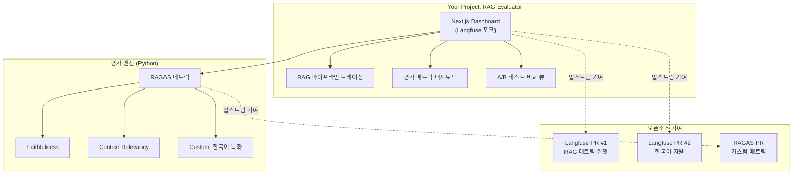

# 📊 RAG Evaluation & Observability — 오픈소스 연계 프로젝트 상세 기획

> **목표**: 기존 RAG의 "평가 부재" 한계를 발견하고, 오픈소스 프로젝트에 기여하면서 자신만의 RAG 평가 플랫폼을 구축하는 여정

---

## 1. 왜 오픈소스와 엮어야 하는가?

| 이점                  | 설명                                                              |
| --------------------- | ----------------------------------------------------------------- |
| **포트폴리오 임팩트** | "개인 프로젝트"보다 "오픈소스 컨트리뷰터"가 채용/이직에 훨씬 강력 |
| **코드 품질 성장**    | 코드 리뷰를 통해 시니어 개발자로부터 피드백                       |
| **네트워킹**          | 글로벌 AI 엔지니어 커뮤니티에 이름을 알림                         |
| **실전 경험**         | 프로덕션 레벨의 코드베이스에서 설계 패턴 학습                     |

---

## 2. 오픈소스 후보 분석

### 🥇 추천 1: Langfuse (⭐ 6.8k+)

| 항목              | 내용                                                            |
| ----------------- | --------------------------------------------------------------- |
| **GitHub**        | [langfuse/langfuse](https://github.com/langfuse/langfuse)       |
| **기술 스택**     | **Next.js** (TypeScript) + Prisma + PostgreSQL + ClickHouse     |
| **왜 좋은가**     | 현재 대시보드 프로젝트와 **동일 스택(Next.js)**. 진입 장벽 최저 |
| **기여 영역**     | 대시보드 UI, 평가 메트릭 시각화, SDK 개선                       |
| **라이선스**      | MIT (자유롭게 포크 & 수정 가능)                                 |
| **한국 커뮤니티** | 성장 중, 경쟁이 적어 기여 기회 多                               |

#### Langfuse 기여 전략
```
Phase 1: Good First Issues 해결 (2-3주)
    → UI 버그 픽스, 문서 번역, 타입 에러 수정
    → GitHub 프로필에 Contributor 뱃지 획득

Phase 2: 기능 기여 (1-2개월)
    → RAG 전용 평가 대시보드 컴포넌트 개발
    → 한국어 로케일 지원 PR
    → Custom Metric 시각화 위젯

Phase 3: 자신만의 포크 프로젝트 (지속)
    → Langfuse 코어를 베이스로 RAG 특화 평가 플랫폼 구축
    → 블로그에 개발 과정 기록
```

---

### 🥈 추천 2: RAGAS (⭐ 7.5k+)

| 항목          | 내용                                                                    |
| ------------- | ----------------------------------------------------------------------- |
| **GitHub**    | [explodinggradients/ragas](https://github.com/explodinggradients/ragas) |
| **기술 스택** | **Python** (Pydantic, LangChain 통합)                                   |
| **왜 좋은가** | RAG 평가의 **사실상 표준**. 커스텀 메트릭 확장이 용이                   |
| **기여 영역** | 새로운 평가 메트릭, 한국어 지원, 벤치마크 데이터셋                      |
| **라이선스**  | Apache 2.0                                                              |

#### RAGAS 기여 전략
```
Phase 1: 커스텀 메트릭 개발
    → 한국어 Faithfulness 메트릭 (형태소 분석 기반)
    → 멀티턴 대화 평가 메트릭
    → PR 제출 → 커뮤니티 리뷰

Phase 2: 벤치마크 기여
    → 한국어 RAG 벤치마크 데이터셋 제작
    → RAGAS 공식 벤치마크에 포함 제안

Phase 3: 통합 프로젝트
    → RAGAS + Langfuse를 결합한 End-to-End 평가 파이프라인
```

---

### 🥉 추천 3: DeepEval (⭐ 4.5k+)

| 항목          | 내용                                                              |
| ------------- | ----------------------------------------------------------------- |
| **GitHub**    | [confident-ai/deepeval](https://github.com/confident-ai/deepeval) |
| **기술 스택** | **Python** (Pytest 스타일)                                        |
| **왜 좋은가** | CI/CD 파이프라인 통합에 최적. 테스트 자동화 경험 어필 가능        |
| **기여 영역** | 새로운 메트릭, Red-Teaming 시나리오, CI 템플릿                    |
| **라이선스**  | Apache 2.0                                                        |

---

## 3. 🏗️ 추천 프로젝트 구성 (3가지 방안)

### 방안 A: "Langfuse 포크 + RAG 특화" (가장 추천 ⭐)

> Langfuse를 포크하여 RAG 평가에 특화된 대시보드를 만들고, 핵심 개선 사항은 업스트림에 PR



**장점**: Next.js 경험 활용 + 프론트엔드/백엔드 모두 어필 + 오픈소스 기여 이력

---

### 방안 B: "RAGAS 확장 + 자체 대시보드"

> RAGAS에 한국어 메트릭을 기여하고, 결과를 시각화하는 독립 대시보드 구축

```
[Your RAG Pipeline]
    ↓ (Python)
[RAGAS + Custom Metrics]
    ├── Faithfulness Score
    ├── Context Precision/Recall
    ├── Korean NLI Score (신규 기여)
    └── Multi-turn Coherence (신규 기여)
    ↓ (REST API)
[Next.js Dashboard] ← 기존 대시보드에 통합
    ├── 실시간 품질 모니터링
    ├── 질문별 상세 분석
    └── 메트릭 트렌드 차트
```

**장점**: Python(FastAPI) + Next.js 풀스택 어필 + RAGAS 공식 컨트리뷰터

---

### 방안 C: "DeepEval CI/CD + 모니터링"

> DeepEval를 활용해 RAG 품질 테스트 자동화 + GitHub Actions 연동

```
[GitHub Push] → [GitHub Actions]
    ↓
[DeepEval Test Suite]
    ├── test_faithfulness()
    ├── test_context_relevancy()
    ├── test_answer_similarity()
    └── test_korean_quality()  (커스텀)
    ↓
[Test Report] → [Dashboard 시각화]
    ├── 빌드별 품질 트렌드
    ├── 리그레션 알림
    └── PR별 품질 비교
```

**장점**: DevOps/MLOps 역량 어필 + CI/CD 경험 + 자동화 파이프라인

---

## 4. 📋 방안 A 상세 실행 계획 (추천)

### Phase 1: 오픈소스 온보딩 (1-2주)

| 주차 | 할 일                                 | 산출물               |
| ---- | ------------------------------------- | -------------------- |
| 1주  | Langfuse 로컬 셋업 (Docker Compose)   | 로컬 실행 스크린샷   |
| 1주  | codebase 분석 (Next.js + Prisma 구조) | 아키텍처 분석 블로그 |
| 2주  | Good First Issue 2-3개 해결           | Merged PR 링크       |
| 2주  | RAGAS 로컬 셋업 + 기본 평가 실행      | 평가 결과 리포트     |

#### 블로그 포스트 #1
> **"RAG를 만들었다. 근데 이게 좋은 건가? — 평가 없는 AI의 위험성"**
> - 기존 RAG의 평가 부재 문제 제기
> - RAGAS, Langfuse, DeepEval 비교 분석
> - "직접 기여하면서 해결하기로 했다"

---

### Phase 2: 핵심 기능 개발 (3-4주)

| 주차 | 할 일                                    | 산출물            |
| ---- | ---------------------------------------- | ----------------- |
| 3주  | RAG 파이프라인 구축 (FastAPI + pgvector) | 동작하는 RAG API  |
| 3주  | RAGAS 연동 + 평가 자동화 스크립트        | 평가 파이프라인   |
| 4주  | Langfuse 포크 → RAG 전용 대시보드 UI     | 대시보드 스크린샷 |
| 5주  | 한국어 Faithfulness 커스텀 메트릭 개발   | RAGAS PR 제출     |
| 6주  | Langfuse에 RAG 메트릭 위젯 PR 제출       | Langfuse PR 제출  |

#### 블로그 포스트 #2
> **"Langfuse 코드베이스 분석: Next.js 오픈소스 프로젝트의 아키텍처"**
> - Langfuse 내부 구조 분석 (App Router, Prisma, tRPC)
> - 첫 번째 PR 제출까지의 여정
> - 코드 리뷰에서 배운 것들

#### 블로그 포스트 #3
> **"RAGAS로 RAG 품질 자동 평가하기: Faithfulness 메트릭의 한계와 개선"**
> - RAGAS 기본 사용법
> - 한국어에서의 한계점 발견
> - 커스텀 메트릭으로 해결

---

### Phase 3: 통합 및 고도화 (3-4주)

| 주차 | 할 일                             | 산출물                 |
| ---- | --------------------------------- | ---------------------- |
| 7주  | A/B 테스트 기능 (프롬프트 비교)   | 비교 대시보드          |
| 8주  | 현재 포트폴리오 대시보드에 통합   | 프로젝트 카드 추가     |
| 9주  | 전체 README + 데모 영상 제작      | GitHub 리포지토리 공개 |
| 10주 | 한국어 RAG 벤치마크 데이터셋 공개 | HuggingFace 데이터셋   |

#### 블로그 포스트 #4
> **"오픈소스 기여자가 되기까지: Langfuse와 RAGAS에 PR을 보낸 이야기"**
> - 기여 과정 전체 회고
> - 오픈소스 기여 팁
> - 포트폴리오에 어떻게 활용했는지

---

## 5. 🛠️ 기술 스택 정리

```
┌─────────────────────────────────────────────────────┐
│                   Frontend Layer                     │
│  Next.js (Langfuse 포크) + 기존 포트폴리오 대시보드   │
│  Recharts / Tremor (시각화) + Framer Motion          │
├─────────────────────────────────────────────────────┤
│                   API Layer                          │
│  FastAPI (Python) — RAG 파이프라인 + 평가 엔진       │
│  Spring Boot (Java) — 데이터 수집 + 스케줄링 (선택)   │
├─────────────────────────────────────────────────────┤
│                   Evaluation Layer                    │
│  RAGAS + DeepEval + Custom Metrics                   │
│  LLM-as-Judge (GPT-4o / Claude)                     │
├─────────────────────────────────────────────────────┤
│                   Data Layer                         │
│  PostgreSQL + pgvector (벡터 검색)                   │
│  ClickHouse (트레이스 데이터, 분석)                   │
│  Redis (캐싱, 큐)                                    │
├─────────────────────────────────────────────────────┤
│                   Infrastructure                     │
│  Docker Compose (로컬) → Terraform (AWS 배포)        │
│  GitHub Actions (CI/CD + DeepEval 자동 테스트)       │
└─────────────────────────────────────────────────────┘
```

---

## 6. 📈 포트폴리오 임팩트 예상

### GitHub 프로필에 보이는 것
- ✅ **Langfuse** Contributor (PR 2-3개 Merged)
- ✅ **RAGAS** Contributor (커스텀 메트릭 PR)
- ✅ 자체 프로젝트: `rag-eval-dashboard` (⭐ 목표)
- ✅ HuggingFace: 한국어 RAG 벤치마크 데이터셋

### 대시보드 프로젝트 카드
```
📊 RAG Evaluation Platform
├── Status: Active
├── Tags: [Langfuse, RAGAS, Next.js, FastAPI, pgvector]
├── Progress: 75%
└── Links: GitHub | Demo | Blog Series
```

### 블로그 시리즈 (4편)
1. "RAG를 만들었다. 근데 이게 좋은 건가?"
2. "Langfuse 코드베이스 분석: Next.js 오픈소스의 아키텍처"
3. "RAGAS로 RAG 품질 자동 평가하기"
4. "오픈소스 기여자가 되기까지"

---

## 7. 🎯 결론: 어떤 방안을 선택할까?

| 기준            | 방안 A (Langfuse 포크) | 방안 B (RAGAS 확장) | 방안 C (DeepEval CI/CD) |
| --------------- | :--------------------: | :-----------------: | :---------------------: |
| Next.js 활용    |          ⭐⭐⭐           |         ⭐⭐          |            ⭐            |
| 오픈소스 임팩트 |          ⭐⭐⭐           |         ⭐⭐⭐         |           ⭐⭐            |
| 풀스택 어필     |          ⭐⭐⭐           |         ⭐⭐          |           ⭐⭐            |
| 난이도          |           중           |         중          |          중~하          |
| 차별화          |          ⭐⭐⭐           |         ⭐⭐          |            ⭐            |

> **추천**: 방안 A를 메인으로 진행하면서, Phase 2에서 RAGAS 기여(방안 B)를 병행

이 조합이면 **"Next.js 오픈소스 기여 + Python AI 평가 엔진 + 풀스택 대시보드"**라는 세 마리 토끼를 잡을 수 있습니다.
