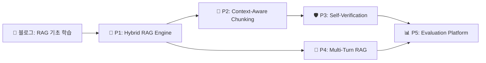

# 🧠 RAG 프로젝트 추천: "한계를 넘어서"

> **컨셉**: 블로그에서 기존 RAG를 공부하며 한계점을 발견하고, 그 한계를 직접 해결하는 프로젝트를 구축하는 여정

---

## 배경: 기존 RAG의 한계점

| 한계                    | 설명                                               |
| ----------------------- | -------------------------------------------------- |
| **Lost in the Middle**  | 검색된 문서가 많아지면 중간 문서의 정보가 무시됨   |
| **단일 검색 전략**      | 의미 검색(Semantic)만 사용하면 키워드 매칭에 약함  |
| **정적 Chunking**       | 고정 크기 분할은 문맥을 깨뜨릴 수 있음             |
| **단발성 질의**         | 멀티턴 대화에서 맥락을 유지하지 못함               |
| **환각(Hallucination)** | 검색 결과와 무관한 답변을 생성함                   |
| **평가 부재**           | RAG 파이프라인의 품질을 정량적으로 측정하기 어려움 |

---

## 프로젝트 1: 🔀 Adaptive Hybrid RAG Engine

### 해결하는 한계
> "단일 검색 전략으로는 다양한 질문 유형에 대응할 수 없다"

### 핵심 아이디어
질문의 유형(키워드 기반 vs 의미 기반 vs 복합)을 **자동 분류**하고, 최적의 검색 전략을 **동적으로 선택**하는 엔진

### 아키텍처
```
사용자 질문
    ↓
[Query Classifier] ── 키워드형 → BM25 검색
    │                  의미형   → Vector 검색 (pgvector)
    │                  복합형   → Hybrid (RRF 가중합)
    ↓
[Re-Ranker] (Cross-Encoder)
    ↓
[LLM Generator] + 출처 인용
```

### 기술 스택
- **Backend**: Python (FastAPI) / Java (Spring Boot)
- **Vector DB**: PostgreSQL + pgvector
- **검색**: Elasticsearch (BM25) + Sentence Transformers
- **Re-Ranking**: cross-encoder/ms-marco-MiniLM
- **LLM**: OpenAI GPT-4o / Claude 3.5
- **Frontend**: Next.js (대시보드와 통합)

### 블로그 스토리라인
1. 📝 "RAG 입문: 벡터 검색만으로 충분할까?" (한계 발견)
2. 📝 "하이브리드 검색의 힘: BM25 + Vector의 시너지"
3. 📝 "Query Classifier 구현기: 질문이 답을 결정한다"
4. 📝 "Re-Ranking으로 정밀도 95% 달성하기"

### 난이도: ⭐⭐⭐ (중급)

---

## 프로젝트 2: 🧩 Context-Aware Chunking Pipeline

### 해결하는 한계
> "고정 크기 청킹은 문맥을 파괴하고, 관련 정보를 분리시킨다"

### 핵심 아이디어
문서의 **구조(헤더, 문단, 코드 블록)**를 인식하여 의미 단위로 청킹하고, 부모-자식 관계를 유지하는 **계층적 인덱싱** 시스템

### 아키텍처
```
원본 문서 (PDF, MD, HTML)
    ↓
[Document Parser] → 구조 분석 (헤더/문단/표/코드)
    ↓
[Semantic Chunker] → 의미 유사도 기반 분할점 감지
    ↓
[Hierarchical Indexer]
    ├── Parent Chunk (요약)
    ├── Child Chunk (상세)
    └── Sibling Links (관련 청크 연결)
    ↓
[Multi-Level Retrieval]
    → 질문 → Child 검색 → Parent 컨텍스트 확장 → 답변 생성
```

### 기술 스택
- **Chunking**: LangChain SemanticChunker + Custom Splitters
- **파싱**: Unstructured.io, PyMuPDF
- **저장**: PostgreSQL (pgvector + 메타데이터)
- **Orchestration**: LangGraph
- **IaC**: Terraform (AWS 배포)

### 블로그 스토리라인
1. 📝 "Token 512 vs 1024: 청크 크기의 딜레마"
2. 📝 "구조를 이해하는 청커 만들기: Semantic Chunking"
3. 📝 "Parent-Child Retrieval로 'Lost in the Middle' 해결하기"
4. 📝 "실전 벤치마크: 고정 vs 적응형 청킹 성능 비교"

### 난이도: ⭐⭐⭐⭐ (중상급)

---

## 프로젝트 3: 🛡️ Hallucination-Free RAG with Self-Verification

### 해결하는 한계
> "RAG도 환각을 일으킨다. 검색 결과에 없는 내용을 지어낸다"

### 핵심 아이디어
LLM이 생성한 답변의 **각 문장을 검색 결과와 대조**하여 근거가 없는 문장을 자동 감지·수정하는 **자기 검증(Self-Verification)** 파이프라인

### 아키텍처
```
질문 → [Retriever] → 관련 문서 K개
    ↓
[Generator] → 초안 답변
    ↓
[Claim Decomposer] → 문장별 분해
    ↓
[Evidence Checker] → 각 문장 ↔ 출처 NLI 검증
    │
    ├── Supported ✅ → 유지 + 출처 태그
    ├── Not Enough Info ⚠️ → 재검색 또는 "확인 불가" 표시
    └── Contradicted ❌ → 삭제 또는 수정
    ↓
[Final Answer] + 신뢰도 점수 + 출처 인용
```

### 기술 스택
- **NLI 모델**: facebook/bart-large-mnli (자연어 추론)
- **Backend**: FastAPI + LangGraph (멀티스텝 워크플로)
- **Frontend**: Next.js (신뢰도 시각화 대시보드)
- **평가**: RAGAS (faithfulness, relevancy 자동 측정)

### 블로그 스토리라인
1. 📝 "RAG에서도 환각이? 실험으로 증명하기"
2. 📝 "자연어 추론(NLI)으로 답변 검증 시스템 구축"
3. 📝 "신뢰도 점수 도입: 사용자가 믿을 수 있는 AI"
4. 📝 "RAGAS로 RAG 품질 자동 평가하기"

### 난이도: ⭐⭐⭐⭐⭐ (고급)

---

## 프로젝트 4: 💬 Multi-Turn Conversational RAG

### 해결하는 한계
> "단발성 질의만 가능하여, 후속 질문에서 맥락을 잃어버린다"

### 핵심 아이디어
대화 히스토리를 기반으로 **질문을 재작성(Query Rewriting)**하고, 대화 흐름에 따라 검색 전략을 조정하는 **대화형 RAG**

### 아키텍처
```
[대화 히스토리]
    ↓
[Query Rewriter] → "이전 대화 맥락 + 현재 질문" → 독립적 질문으로 변환
    ↓
[Contextual Retriever] → 대화 맥락 반영 검색
    ↓
[Memory Manager]
    ├── Short-term: 현재 세션 (최근 N턴)
    ├── Long-term: 사용자별 관심사 프로필
    └── Episodic: 주제별 대화 요약
    ↓
[Generator] → 맥락 유지 답변 생성
```

### 기술 스택
- **Orchestration**: LangGraph (상태 머신 기반 대화 관리)
- **Memory**: Redis (세션) + PostgreSQL (장기 기억)
- **Query Rewriting**: LLM Chain (few-shot prompting)
- **Frontend**: Next.js + WebSocket (실시간 대화 UI)
- **배포**: Docker + Terraform (AWS ECS)

### 블로그 스토리라인
1. 📝 "RAG의 기억상실: 왜 후속 질문에 답하지 못할까"
2. 📝 "Query Rewriting: 대화의 맥락을 검색에 전달하기"
3. 📝 "3단계 메모리 아키텍처로 진짜 대화형 AI 만들기"
4. 📝 "LangGraph로 복잡한 대화 흐름 관리하기"

### 난이도: ⭐⭐⭐⭐ (중상급)

---

## 프로젝트 5: 📊 RAG Evaluation & Observability Platform

### 해결하는 한계
> "RAG 파이프라인을 만들었지만, 얼마나 좋은지 모른다"

### 핵심 아이디어
RAG 파이프라인의 각 단계(검색, 생성, 답변)를 **실시간으로 모니터링**하고, **A/B 테스트**와 **자동 평가**를 제공하는 관측 플랫폼

### 아키텍처
```
[RAG Pipeline] → 각 단계 로깅
    ↓
[Trace Collector] (OpenTelemetry)
    ├── Retrieval Metrics: Recall@K, MRR, 검색 지연시간
    ├── Generation Metrics: Faithfulness, Relevancy, Toxicity
    └── User Metrics: 만족도, 클릭률, 재질문율
    ↓
[Evaluation Engine]
    ├── RAGAS 자동 평가
    ├── LLM-as-Judge (GPT-4o 기반 평가)
    └── Human Feedback 수집
    ↓
[Dashboard] (Next.js)
    ├── 실시간 파이프라인 시각화
    ├── 품질 트렌드 차트
    └── A/B 테스트 결과 비교
```

### 기술 스택
- **트레이싱**: OpenTelemetry + LangSmith / Langfuse
- **평가**: RAGAS, DeepEval
- **Backend**: FastAPI / Spring Boot
- **Dashboard**: Next.js + Recharts (기존 대시보드 확장)
- **DB**: PostgreSQL + TimescaleDB (시계열 메트릭)

### 블로그 스토리라인
1. 📝 "RAG를 만들었다. 근데 이게 좋은 건가?"
2. 📝 "RAGAS와 LLM-as-Judge로 RAG 자동 평가하기"
3. 📝 "실시간 RAG 관측 대시보드 구축기"
4. 📝 "A/B 테스트로 프롬프트와 검색 전략 최적화하기"

### 난이도: ⭐⭐⭐ (중급)

---

## 🗺️ 추천 로드맵



### 추천 시작 순서

| 순서 | 프로젝트                                 | 이유                                                                |
| ---- | ---------------------------------------- | ------------------------------------------------------------------- |
| 1st  | **P1: Hybrid RAG**                       | RAG의 가장 기본적 한계를 다루며, 핵심 개념을 모두 경험              |
| 2nd  | **P5: Evaluation**                       | 측정 없이는 개선 불가. 평가 체계를 먼저 세우면 이후 프로젝트에 활용 |
| 3rd  | **P2: Chunking** 또는 **P4: Multi-Turn** | 관심사에 따라 선택                                                  |
| 4th  | **P3: Self-Verification**                | 가장 고급. 앞선 프로젝트 경험이 있으면 도전 가능                    |

---

## 💡 대시보드 통합 아이디어

각 프로젝트를 이 대시보드의 **Projects** 섹션에 추가하고, 블로그 포스트로 학습 여정을 기록하면 자연스러운 포트폴리오가 완성됩니다:

- **Projects**: 각 RAG 프로젝트 카드 (진행률, 기술 태그)
- **Blog Posts**: "한계 발견 → 해결 과정" 시리즈
- **Tech Stack**: RAG 관련 기술 (LangChain, pgvector, RAGAS 등) 추가
- **Contribution Graph**: 프로젝트 커밋 활동 시각화
